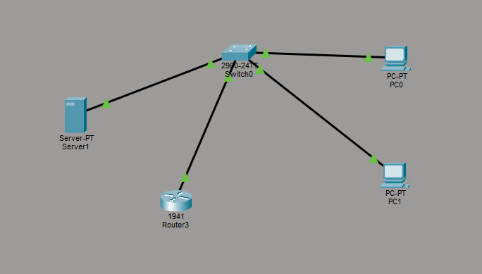

# Basic Office Network with Web Server

## Description
This project demonstrates a simple office network built using Cisco Packet Tracer.
A basic web server is deployed and accessed by multiple clients.

## Topology

## Devices
- 1x Cisco Router (1941)
- 1x Cisco Switch (2960)
- 2x PCs
- 1x Server

## IP Addressing

| Device | IP Address |
|--------|------------|
| Router | 192.168.1.1 |
| Server | 192.168.1.10 |
| PC0 | 192.168.1.20 |
| PC1 | 192.168.1.21 |

Subnet: 255.255.255.0

## Services
- HTTP Web Server

## Testing
From any PC:
http://192.168.1.10

