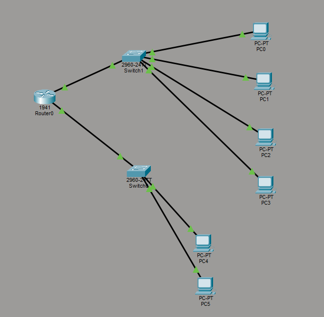

# VLAN Segmentation with Inter-VLAN Routing

## Description

This project demonstrates network segmentation using VLANs in Cisco Packet Tracer. Three departments (IT, HR, Accounting) are isolated into separate VLANs and connected through a router using the Router-on-a-Stick technique.

## Topology



**Devices used:**
- 1x Cisco 1941 Router
- 2x Cisco 2960-24TT Switch
- 6x PC

## VLAN & IP Plan

| VLAN | Department | Network | Gateway |
|------|------------|---------|---------|
| VLAN 10 | IT | 192.168.10.0/24 | 192.168.10.1 |
| VLAN 20 | HR | 192.168.20.0/24 | 192.168.20.1 |
| VLAN 30 | Accounting | 192.168.30.0/24 | 192.168.30.1 |

## PC IP Addresses

| PC | IP Address | Subnet Mask | Gateway | VLAN |
|----|------------|-------------|---------|------|
| PC0 | 192.168.10.2 | 255.255.255.0 | 192.168.10.1 | 10 |
| PC1 | 192.168.10.3 | 255.255.255.0 | 192.168.10.1 | 10 |
| PC2 | 192.168.20.2 | 255.255.255.0 | 192.168.20.1 | 20 |
| PC3 | 192.168.20.3 | 255.255.255.0 | 192.168.20.1 | 20 |
| PC4 | 192.168.30.2 | 255.255.255.0 | 192.168.30.1 | 30 |
| PC5 | 192.168.30.3 | 255.255.255.0 | 192.168.30.1 | 30 |

## Configuration

### Switch1 (VLAN 10 & 20)
​```
vlan 10
 name IT
vlan 20
 name HR

interface fa0/1
 switchport mode access
 switchport access vlan 10

interface fa0/2
 switchport mode access
 switchport access vlan 10

interface fa0/3
 switchport mode access
 switchport access vlan 20

interface fa0/4
 switchport mode access
 switchport access vlan 20

interface gi0/1
 switchport mode trunk
​```

### Switch0 (VLAN 30)
​```
vlan 30
 name Accounting

interface fa0/1
 switchport mode access
 switchport access vlan 30

interface fa0/2
 switchport mode access
 switchport access vlan 30

interface gi0/1
 switchport mode trunk
​```

### Router1 (Router-on-a-Stick)
​```
interface gi0/0
 no shutdown

interface gi0/0.10
 encapsulation dot1Q 10
 ip address 192.168.10.1 255.255.255.0

interface gi0/0.20
 encapsulation dot1Q 20
 ip address 192.168.20.1 255.255.255.0

interface gi0/1
 no shutdown

interface gi0/1.30
 encapsulation dot1Q 30
 ip address 192.168.30.1 255.255.255.0
​```

## Test Results

| Source | Destination | Result |
|--------|-------------|--------|
| PC0 (VLAN 10) | PC1 (VLAN 10) | Success — 0% packet loss |
| PC0 (VLAN 10) | PC2 (VLAN 20) | Success — Inter-VLAN routing OK |
| PC0 (VLAN 10) | PC4 (VLAN 30) | Success — Inter-VLAN routing OK |

> First ping timeout is normal due to ARP resolution.

## What I Learned

- Creating and naming VLANs on Cisco switches
- Assigning access ports to VLANs
- Configuring trunk ports between switches and router
- Router-on-a-Stick technique for inter-VLAN routing
- Subinterface configuration with dot1Q encapsulation